# Project demo and architecture map

This demo shows implemented behavior with a private workstation and prestarted model services.
It does not establish fiscal accuracy or production readiness.

```mermaid
flowchart LR
    S[Official Skatteetaten pages] --> C[Crawler and manifests]
    C --> P[Parser / normalizer / chunker]
    P --> E[Embedding adapter]
    E --> Q[(Qdrant)]
    B[Browser] --> F[Next.js fixed proxy]
    F --> A[FastAPI]
    A --> R[Tax-year router]
    R --> H[Dense + BM25 / fusion]
    Q --> H
    H --> X[Optional reranker]
    X --> G[Context and injection filter]
    G --> L[External LLM]
    L --> V[Schema + citation/year validation]
    V --> B
```

## Five-minute private demo

1. Show the crawler inventory at `/crawler`; distinguish downloaded captures from indexed
   evidence. Do not start a live crawl during a timed presentation.
2. Show the selected collection and model endpoints at `/settings`. The operator key stays in
   memory and is not included in slides or recordings.
3. Ask a year-explicit, previously verified question in Dense, then Hybrid + Rerank. Explain that
   changing retrieval mode changes dependencies and may produce an operational error.
4. Expand citations and optional final context. The developer inspector is a **separate** query,
   not the answer's exact retrieval trace.
5. Ask an out-of-scope question and a year-sensitive question without a year to demonstrate
   abstention/clarification. Never present an unreviewed tax amount as correct.
6. Show the CI checks, regression artifact comparison, threat model and open release checklist.

Have Qdrant, Ollama, the optional reranker and generator ready before the demo. The API must
point to the same indexed collection and reachable model endpoints. See
[frontend startup](frontend.md), [private deployment](production-readiness.md) and
[current architecture](architecture.md).
